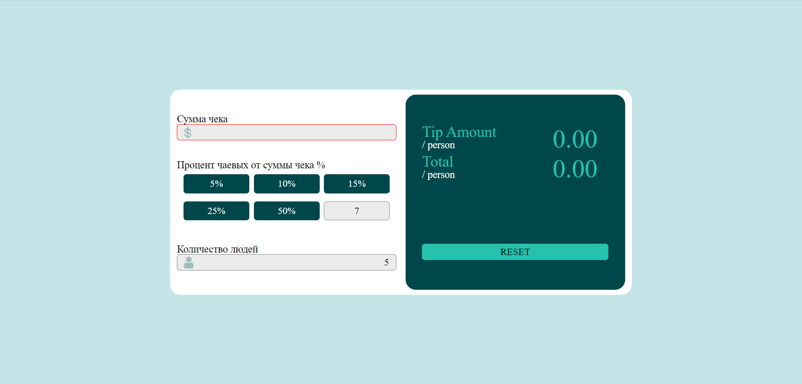

# Калькулятор чаевых

Простое исполнение калькулятора чаевых!

Хостинг: `https://calculator-tips.herokuapp.com/`

## Решаемые задачи

Подсчет чаевых и общую сумму вместе с чаевыми на персону, то есть человек будет понимать сколько чаевыx должен имено он и сразу посчитаную сумму его части из чека и его части на чаевые.

## Описание

Подсчет ведется от трех параметров:
1. Общей суммы за услугу;
2. Какой процент от чаевых хотелось бы заплатить;
3. Количество персон для расчета чаевых и общей суммы на одну персону.

## Удоства:

- Подсчет ведется в реальном времени (как будут коректно введены три параметра: общая сумма; процент чаевых от общей суммы; количество персон.);
- При изменении входных данных будет сразу перерасчет (для понимания разницы);
- Можно сбросить все настройки одним кликом;
- Процент чаевых можно выбрать из набора стандартных или вести определенную сумму если её нет среди стандартных;

- Если выбран стандартный процент чаевых он отмечается чтобы точно не забыть какой был выбран;

- Минималистичный дизайн, все понятно и просто;
- Идет проверка на отрицательные числа в полях где надо вводить данные, если число будет отрицательным оно перезапишится на такое же только положительное;
- Если выходные числа большие идет перерасчет в экспоненциальную нотацию;

- Если число было введено а потом удалено будет уведомляющая подводка;
- Есть адаптив под большенство различных устройств.

  
  

